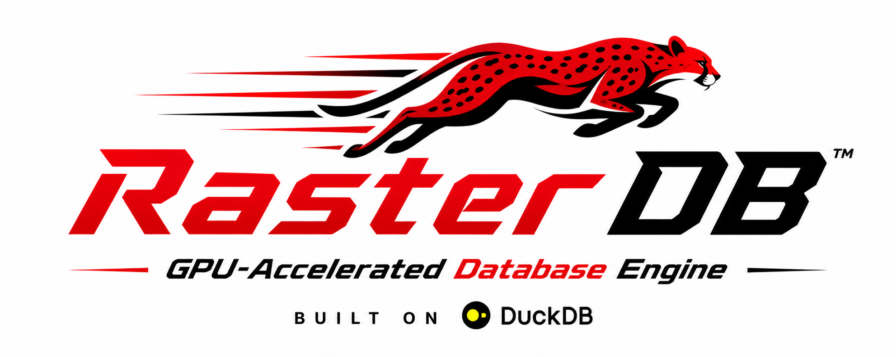

# RasterDB

<p align="center">
  
</p>

RasterDB is a DuckDB extension that enables GPU-accelerated query execution using Vulkan compute shaders and the rasterdf library. It offloads SQL operations (scan, filter, projection, aggregation, join, order, limit) to the GPU for significant performance gains on large datasets.

## Features

### GPU-Accelerated SQL Operators
- **Scan**: Table scans with zero-copy reBAR (Resizable BAR) support
- **Filter**: GPU-side predicate evaluation with stream compaction
- **Projection**: Column selection and arithmetic expression evaluation
- **Aggregation**: 
  - Ungrouped aggregates (SUM, COUNT, MIN, MAX, AVG)
  - Grouped aggregates with multi-column GROUP BY
  - Graphics-pipeline mesh shader (GFXM) and compute shader implementations
- **Join**: Hash joins via graphics-pipeline (simple garuda) or compute shader
- **Order**: Radix sort for ORDER BY operations
- **Limit**: Efficient LIMIT/OFFSET with index generation

### Performance Optimizations
- **Resizable BAR (reBAR)**: Zero-copy GPU access to host staging memory
- **GPU Buffer Manager**: Column caching and intelligent memory management
- **Plan Hints**: LIMIT pushdown and count(*) optimizations
- **Pipelined Scan**: Direct staging buffer writes during scan (no separate upload)
- **Expression Evaluation**: GPU-side binary operations (ADD, SUB, MUL, DIV, MOD)

### Supported Data Types
- Integer types: INT32, INT64
- Floating-point: FLOAT32, FLOAT64
- Timestamps: TIMESTAMP_DAYS

### Logging
- Color-coded log levels (DEBUG, INFO, WARN, ERROR)
- Configurable at build time and runtime via environment variables
- Uniform logging across RasterDB and rasterdf

## Architecture

RasterDB follows a layered architecture:

1. **DuckDB Extension Layer**: Hooks into DuckDB's query execution via `gpu_execution()` function
2. **GPU Executor**: Translates DuckDB logical operators to GPU operations
3. **GPU Buffer Manager**: Manages GPU memory, caching, and reBAR staging buffers
4. **RasterDF**: Vulkan compute shader library for low-level GPU operations

The executor is split into modular files by operator type:
- `gpu_executor_core.cpp`: Top-level dispatch and initialization
- `gpu_executor_scan.cpp`: Table scan operations
- `gpu_executor_filter.cpp`: Filter and comparison evaluation
- `gpu_executor_projection.cpp`: Projection and expression evaluation
- `gpu_executor_aggregate.cpp`: Ungrouped aggregates
- `gpu_executor_grouped_aggregate.cpp`: Grouped aggregates with decomposition
- `gpu_executor_order.cpp`: ORDER BY sorting
- `gpu_executor_limit.cpp`: LIMIT/OFFSET
- `gpu_executor_join.cpp`: Hash joins
- `gpu_executor_result.cpp`: GPU-to-CPU result conversion

## Prerequisites

### System Requirements
- Linux x86_64
- NVIDIA GPU with Vulkan support (tested on RTX 4090)
- Resizable BAR enabled in BIOS/UEFI (recommended for best performance)
- C++20 compiler (GCC 11+, Clang 14+)
- CMake 3.20+

### Software Dependencies

#### RasterDF
RasterDB depends on the rasterdf library. Build it first:

```bash
cd ../rasterdf
./build.sh --release
```

#### Vulkan SDK
Install Vulkan headers and loader:

```bash
# Ubuntu/Debian
sudo apt install vulkan-sdk libvulkan-dev

# Or download from LunarG
# https://vulkan.lunarg.com/sdk/home
```

#### spdlog
Install the spdlog logging library:

```bash
# Option 1: System package
sudo apt install libspdlog-dev

# Option 2: Via conda/pixi
pixi install spdlog
```

#### DuckDB
DuckDB is included as a git submodule. Initialize it:

```bash
git submodule update --init --recursive
```

## Installation

### Quick Install

Use the provided installation script:

```bash
./install.sh
```

This script will:
1. Check and install system dependencies (Vulkan, spdlog)
2. Verify rasterdf is built
3. Build DuckDB
4. Build the RasterDB extension
5. Install the extension to a standard location

### Manual Install

#### Step 1: Build RasterDF
```bash
cd ../rasterdf
./build.sh --release
```

#### Step 2: Install Dependencies
```bash
sudo apt install vulkan-sdk libvulkan-dev libspdlog-dev
```

#### Step 3: Initialize Submodules
```bash
cd rasterdb
git submodule update --init --recursive
```

#### Step 4: Build RasterDB
```bash
./build.sh --release --log-level=info
```

The extension will be built at:
```
build/release/extension/rasterdb/rasterdb.duckdb_extension
```

#### Step 5: Set Shader Directory
```bash
export RASTERDF_SHADER_DIR=/usr/local/share/rasterdf/shaders
```

## Usage

### Loading the Extension

```bash
duckdb -unsigned
```

```sql
LOAD '/path/to/rasterdb.duckdb_extension';
```

### Running GPU Queries

Use the `gpu_execution()` function to execute queries on the GPU:

```sql
-- Simple aggregation
SELECT * FROM gpu_execution('SELECT sum(a) FROM t');

-- Complex query with joins and aggregations
SELECT * FROM gpu_execution('
  SELECT l.l_orderkey, 
         sum(l.l_extendedprice * (1.0 - l.l_discount)) as revenue,
         o.o_orderdate_int, 
         o.o_shippriority 
  FROM lineitem_int l 
  INNER JOIN orders_int o ON l.l_orderkey = o.o_orderkey 
  INNER JOIN customer_int c ON c.c_custkey = o.o_custkey 
  WHERE c.c_mktsegment_id = 2 
    AND o.o_orderdate_int < 19950315 
    AND l.l_shipdate_int > 19950315 
  GROUP BY l.l_orderkey, o.o_orderdate_int, o.o_shippriority 
  ORDER BY revenue DESC, o.o_orderdate_int
');
```

### Configuration

#### Log Level Control

Set the default log level at build time:
```bash
./build.sh --release --log-level=debug
```

Override at runtime:
```bash
export RASTERDB_LOG_LEVEL=debug
export SIRIUS_LOG_LEVEL=debug
```

Available levels: `trace`, `debug`, `info`, `warn`, `error`, `critical`, `none`

#### GPU Configuration

Extension options (set via DuckDB `SET` command):

```sql
-- Enable/disable GPU execution
SET enable_gpu_execution = true;

-- Enable DuckDB CPU fallback on GPU error
SET enable_duckdb_fallback = true;
```

## Build Options

The `build.sh` script supports the following options:

```bash
./build.sh [OPTIONS]

Options:
  --release        Build in release mode (optimized) [default]
  --debug          Build in debug mode (with symbols)
  --clean          Clean build directory before building
  --log-level=LEVEL  Set default log level (debug|info|warn|error|none)
```

Examples:
```bash
# Release build with debug logging
./build.sh --release --log-level=debug

# Debug build with clean
./build.sh --debug --clean

# Minimal logging for production
./build.sh --release --log-level=error
```

## Project Structure

```
rasterdb/
├── src/
│   ├── gpu/
│   │   ├── executor/          # GPU executor implementation (split by operator)
│   │   ├── gpu_context.cpp    # GPU context initialization
│   │   ├── gpu_buffer_manager.cpp  # GPU memory management
│   │   ├── gpu_table.cpp      # GPU table representation
│   │   └── gpu_scan_executor.cpp  # Scan executor
│   ├── include/
│   │   ├── gpu/               # GPU-related headers
│   │   └── log/               # Logging headers
│   ├── config.cpp             # Extension configuration
│   └── rasterdb_extension.cpp # Extension entry point
├── cmake/                     # CMake presets and configuration
├── duckdb/                    # DuckDB submodule
├── build.sh                   # Build script
├── install.sh                 # Installation script
├── CMakeLists.txt             # CMake configuration
└── README.md                  # This file
```

## Testing

To run tests (when available):

```bash
cd build/release
ctest
```

## Troubleshooting

### "librasterdf.so not found"
Build rasterdf first:
```bash
cd ../rasterdf
./build.sh --release
```

### "Vulkan not found"
Install Vulkan SDK:
```bash
sudo apt install vulkan-sdk libvulkan-dev
```

### "spdlog not found"
Install spdlog:
```bash
sudo apt install libspdlog-dev
# or via pixi
pixi install spdlog
```

### GPU not detected
Check Vulkan installation:
```bash
vulkaninfo
```

Ensure your GPU driver supports Vulkan and the device is visible.

### Resizable BAR not enabled
Check BIOS/UEFI settings for "Above 4G Decoding" or "Resizable BAR". Without reBAR, the extension will fall back to slower device memory uploads.

## Performance Tips

1. **Enable reBAR**: Ensure Resizable BAR is enabled in BIOS for zero-copy GPU access
2. **Use appropriate data types**: Prefer INT32/FLOAT32 over INT64/FLOAT64 when possible
3. **Batch operations**: Process larger batches to amortize GPU kernel launch overhead
4. **Limit logging**: Set log level to `warn` or `error` in production
5. **Cache columns**: The GPU buffer manager caches frequently accessed columns

## Contributing

Contributions are welcome! Please follow these guidelines:

1. Follow the existing code style (see `.clang-format`)
2. Add tests for new features
3. Update documentation
4. Split large files by operator type (see `src/gpu/executor/`)

## License

Apache License 2.0 - see LICENSE file for details

## Acknowledgments

- **DuckDB**: In-memory analytical database
- **RasterDF**: Vulkan compute shader library for GPU data processing
- **Vulkan**: Cross-platform GPU API
- **spdlog**: Fast C++ logging library

## Contact

For issues, questions, or contributions, please open an issue on the project repository.
