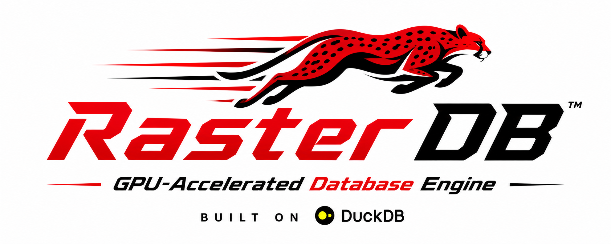

<p align="center">
  
</p>

<p align="center">
  <a href="LICENSE"></a>
  
  
  
</p>

# RasterDB

RasterDB is a DuckDB extension that executes supported analytical SQL pipelines on Vulkan GPUs through RasterDF. It keeps DuckDB's SQL front end and optimizer, then lowers supported physical operators into a GPU pipeline for scan, filter, projection, aggregation, joins, ordering, and limit/top-N.

The extension is aimed at research and systems work on portable GPU query processing: it is CUDA-free, Vulkan-first, and can run on NVIDIA, AMD, Intel, or software Vulkan devices when the selected device exposes the required features.

## Highlights

- DuckDB table function entry point: `gpu_execution(sql)`.
- Vulkan GPU execution through RasterDF's native C++ backend.
- GPU table scan, filter, projection, expression evaluation, grouped and ungrouped aggregation.
- Hash and Garuda join paths for supported equi-join and selected non-equi workloads.
- GPU order by, top-N, and limit operators.
- Dense and tuple groupby paths for TPC-H-style integer workloads.
- Late materialization and projection pruning in join-heavy pipelines.
- CPU fallback through DuckDB for unsupported operators or GPU execution errors.
- Device selection through `RASTERDF_DEVICE`.
- `rduckdb` wrapper for loading the extension with the right runtime environment.

## Architecture

```text
SQL query
  -> DuckDB parser, binder, optimizer
  -> RasterDB physical plan generator
  -> Raster pipeline executor
  -> RasterDB GPU executor
  -> RasterDF Vulkan operators
  -> GPU result table streamed back to DuckDB
```

Key directories:

| Path | Purpose |
| --- | --- |
| `src/rasterdb_extension.cpp` | Extension registration, `gpu_execution`, fallback, buffer initialization |
| `src/gpu` | GPU context, buffer manager, table model, executor, and physical pipeline |
| `src/gpu/executor` | Operator implementations for scan, filter, projection, aggregate, join, order, and limit |
| `src/include` | RasterDB internal headers |
| `duckdb` | DuckDB source submodule used to build the extension shell |
| `test` | SQL/data correctness tests and expected answers |
| `build/<preset>` | DuckDB binary and compiled extension artifacts |

## Requirements

Required:

- Linux x86_64
- CMake 3.20 or newer
- C++20 compiler, such as GCC 11+ or Clang 14+
- Git and DuckDB submodules
- Vulkan loader, headers, and shader compiler
- RasterDF installed system-wide

Ubuntu/Debian packages:

```bash
sudo apt update
sudo apt install -y build-essential gcc g++ cmake ninja-build git \
  libvulkan-dev vulkan-tools glslang-tools libspdlog-dev python3-pip
```

Python packages used by the TPC-H helper scripts and checks:

```bash
python3 -m pip install --upgrade pip
python3 -m pip install numpy pandas matplotlib pytest duckdb
```

The build requires a working Vulkan toolchain and `glslc` shader compiler. If your distribution does not provide `glslc` through `glslang-tools`, install the LunarG Vulkan SDK or the distribution's Shaderc package.

GPU/runtime notes:

- NVIDIA and AMD discrete GPUs are the most mature targets.
- Integrated GPUs can work when the driver exposes the required Vulkan features.
- Current RasterDF context creation requires features such as `bufferDeviceAddress`, `shaderInt64`, `shaderFloat64`, 64-bit shader atomics, and graphics atomics.
- Resizable BAR / Smart Access Memory is recommended for the fastest host-visible device-local memory path.

## Install

Clone RasterDF and RasterDB with submodules. The `--recurse-submodules` flag is important because both repositories need their submodules for a complete build:

```bash
mkdir -p ~/Device/IMPORTANT
cd ~/Device/IMPORTANT
git clone --recurse-submodules https://github.com/akashmaji946/rasterdf.git rasterdf
git clone --recurse-submodules https://github.com/akashmaji946/rasterdb.git rasterdb
```

RasterDB depends on RasterDF at build time and runtime. Build and install RasterDF first:

```bash
cd ~/Device/IMPORTANT/rasterdf
./build.sh --release --log-level INFO
sudo ./install.sh --system
```

The RasterDF system install must provide:

- `/usr/local/lib/librasterdf.so`
- `/usr/local/include/rasterdf`
- `/usr/local/share/rasterdf/shaders`

You can verify the Python side of the install with:

```bash
python3 -c "import rasterdf as rdf; print(rdf.__version__, rdf.get_library_path())"
```

Then build and install RasterDB:

```bash
cd ~/Device/IMPORTANT/rasterdb
sudo ./install.sh
```

The installer:

1. Checks system build dependencies.
2. Verifies `/usr/local/lib/librasterdf.so`.
3. Verifies `/usr/local/share/rasterdf/shaders`.
4. Initializes the DuckDB submodule.
5. Builds the extension.
6. Installs the `rduckdb` wrapper.

Useful installer options:

| Option | Meaning |
| --- | --- |
| `--debug` | Build debug artifacts |
| `--release` | Build release artifacts |
| `--skip-build` | Install existing build artifacts |
| `--skip-deps` | Skip dependency checks |
| `--prefix <path>` | Install under a custom prefix |

## Build From Source

For development builds, RasterDF still needs to be available first. From the RasterDB checkout:

```bash
cd ../rasterdf
./build.sh --release --log-level INFO
sudo ./install.sh --system --skip-deps
cd ../rasterdb
```

Then build RasterDB:

```bash
git submodule update --init --recursive
./build.sh --release --log-level=info
```

Build artifacts:

- `build/release/duckdb`
- `build/release/extension/rasterdb/rasterdb.duckdb_extension`

Run the built shell directly:

```bash
export RASTERDF_SHADER_DIR=/usr/local/share/rasterdf/shaders
./build/release/duckdb -unsigned -cmd "LOAD './build/release/extension/rasterdb/rasterdb.duckdb_extension';"
```

When installed, prefer the wrapper:

```bash
rduckdb my_database.db
```

## Quick Start

With the installed wrapper, the extension is loaded automatically:

```bash
rduckdb tpch_sf5.db
```

```sql
SET enable_duckdb_fallback = true;
SELECT *
FROM gpu_execution('
  SELECT
    l_returnflag_id,
    l_linestatus_id,
    sum(l_quantity) AS sum_qty,
    sum(l_extendedprice) AS sum_base_price,
    count(*) AS count_order
  FROM lineitem_int
  WHERE l_shipdate_int <= 19980902
  GROUP BY l_returnflag_id, l_linestatus_id
');
```

With a raw DuckDB shell, load the built extension by path:

```bash
./build/release/duckdb -unsigned
```

```sql
LOAD './build/release/extension/rasterdb/rasterdb.duckdb_extension';
SELECT * FROM gpu_execution('SELECT count(*) FROM lineitem_int');
```

## Device Selection

RasterDB passes device selection to RasterDF through `RASTERDF_DEVICE`:

```bash
export RASTERDF_DEVICE=amd
rduckdb tpch_sf5.db
```

Supported selector names:

| Selector | Behavior |
| --- | --- |
| unset | Current RasterDB default is NVIDIA |
| `nvidia` | Prefer an NVIDIA GPU |
| `amd` | Prefer an AMD GPU |
| `intel` | Prefer an Intel GPU |
| `any`, `software`, `llvmpipe` | Prefer the software Vulkan renderer |

Use an explicit vendor selector when the machine has multiple Vulkan devices.

## Buffer And Memory Configuration

On extension load, RasterDB initializes the GPU context and buffer manager. The current default regions are configured in `src/rasterdb_extension.cpp`:

| Region | Default |
| --- | --- |
| cache | 3 GB |
| processing | 3 GB |
| staging | 8 GB |
| download | 1 GB |

These defaults are intended for large discrete GPUs. On integrated GPUs or smaller devices, reduce `USE_SIZE_CACHE_GB`, `USE_SIZE_PROCESSING_GB`, `USE_SIZE_STAGING_GB`, and `USE_SIZE_DOWNLOAD_GB`, then rebuild.

The table function below exists for Sirius-compatible manual initialization, but if the buffer manager was already auto-created during extension load it will only report that initialization already happened:

```sql
SELECT * FROM gpu_buffer_init('512MB', '512MB');
```

## Supported SQL Surface

| SQL area | GPU support |
| --- | --- |
| Scan | DuckDB table scan into GPU columns, with projection-aware reads |
| Filter | Comparisons, boolean masks, stream compaction, selected string predicates |
| Projection | Column references, arithmetic, casts, selected scalar expressions |
| Aggregation | `count`, `sum`, grouped and ungrouped paths for supported numeric types |
| Group By | Dense integer, tuple/fixed-width, multi-key, and selected string-hash paths |
| Join | Supported comparison joins with hash/Garuda execution paths |
| Order/Top-N | Radix-sort based ordering and top-N lowering |
| Limit | GPU-side row limiting where the plan shape permits it |

Unsupported operators or expression shapes fall back to DuckDB CPU execution when `enable_duckdb_fallback` is enabled.

## Runtime Controls

| Setting | Example | Purpose |
| --- | --- | --- |
| `RASTERDF_DEVICE` | `export RASTERDF_DEVICE=amd` | Select Vulkan vendor/device policy |
| `RASTERDF_SHADER_DIR` | `/usr/local/share/rasterdf/shaders` | Locate RasterDF SPIR-V shaders |
| `RASTERDB_LOG_LEVEL` | `debug` | Runtime logging level for the installed wrapper |
| `RASTERDB_LOG_DIR` | `/tmp/rasterdb-logs` | Optional log output directory |
| `enable_duckdb_fallback` | `SET enable_duckdb_fallback=true;` | Use CPU fallback when GPU execution cannot complete |

## TPC-H Adapted Suite

RasterDB includes an adapted TPC-H query bundle under `tpch_adapted/`. The suite contains 11 GPU-friendly integer/date-normalized queries copied from the adapted workload:

- `tpch_adapted/tpch_adapted.sql`: Q1, Q3, Q4, Q5, Q6, Q7, Q10, Q11, Q12, Q14, and Q18 wrapped as `SELECT * FROM gpu_execution('...');`
- `tpch_adapted/create_tpch_adapted_db.py`: database generator that creates standard TPC-H tables and `_int` tables used by the adapted queries

Create a sample SF=25 database:

```bash
cd tpch_adapted
python3 create_tpch_adapted_db.py --sf 25
```

The script uses DuckDB's `tpch` extension and creates both the original TPC-H tables and int/float-only tables such as `lineitem_int`, `orders_int`, and `customer_int`.

Run the adapted query suite:

```bash
export RASTERDF_DEVICE=nvidia
rduckdb tpch_sf25.db < tpch_adapted.sql
```

Use `RASTERDF_DEVICE=amd` or `RASTERDF_DEVICE=intel` when targeting a different Vulkan device.

## Testing And Benchmarks

Run the simplest smoke test:

```bash
python3 test/00_simple_setup.py
python3 test/00_simple_run.py
```

Run SQL manually:

```bash
rduckdb test/00_simple.db < test/00_simple.sql
```

TPC-H and ClickBench expected answers are stored under `test/answers`.

## Troubleshooting

- `RasterDF prerequisite not found`: install RasterDF first with `sudo ./install.sh --system`.
- `Failed to allocate buffer`: reduce the default buffer sizes in `src/rasterdb_extension.cpp` or use a GPU with a larger available Vulkan heap.
- `selected Vulkan device lacks required feature`: the chosen Vulkan device or driver does not expose a required RasterDF feature.
- Wrong GPU selected: set `RASTERDF_DEVICE=nvidia`, `amd`, or `intel` explicitly.
- Extension cannot find shaders: set `RASTERDF_SHADER_DIR=/usr/local/share/rasterdf/shaders`.
- Unsupported SQL plan: enable fallback with `SET enable_duckdb_fallback=true;` and inspect debug logs.

## Contributing

Contributions are welcome. Good RasterDB changes usually include:

1. A focused operator, planner, or buffer-manager change.
2. A reproducible SQL query or script under `test`.
3. A correctness comparison against DuckDB CPU output when possible.
4. Updated documentation when public behavior or setup changes.

Build before submitting:

```bash
./build.sh --release --log-level=info
```

## License

RasterDB is released under the MIT License. See [LICENSE](LICENSE).

## Author

RasterDB is developed by Akash Maji and contributors.
